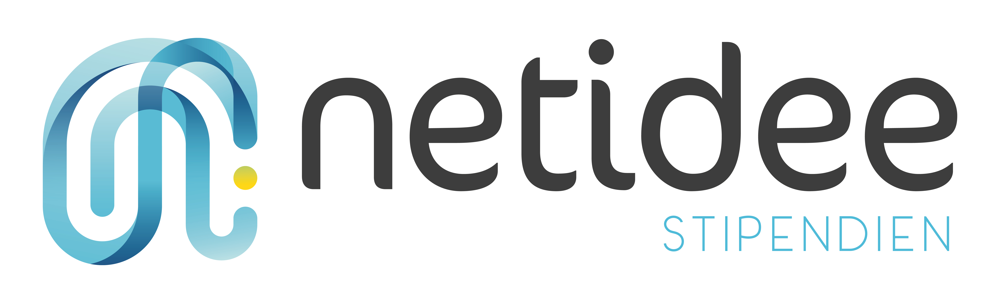

# Dialogical Access to Lightweight Semantic Web Services
The concept of "browsing the web" is being replaced by automated agents that access to structured content. Dialogue systems are a natural way to interact with the machine readable data and services on the web. With DIALSWS, we will develop an approach for annotating web APIs with a lightweight semantic vocabulary based on schema.org and an approach for semi-automatically generating open and flexible goal-oriented dialogue systems based on those Web APIs. 

Schema.org is one of the biggest collaborative vocabulary engineering projects and for the time being the de-facto standart. We aim to leverage the high-level adoption of the vocabulary by web content publishers an give them guidelines and tools to annotate not only their data but also their Web APIs. The semantic description of Web APIs, then will be used for semi-automated generation of intelligent agents, particularly dialogue systems.

## Web API Description with Schema.org Actions

This repository contains a subset of schema.org and SHACL shapes. The shapes cover useful types and properties for API description, based on the analysis made on OpenAPI/SmartAPI Specification and Hydra.

<!--The doc folder contains a multipage HTML documentation created by Ontodocs.-->

See https://actions.semantify.it/vocab for the proposed shapes.

### See also:
* [Mapping and comparison of Schema.org, OpenAPI/SmartAPI and Hydra](Comparison.md)
* [Semantify.it Schema.org Actions Semantify.it Authentication Extension](Authentication.md)

### Publications
Şimşek, U., Kärle, E. & Fensel, D. (2018). Machine Readable Web APIs with Schema.org Action Annotations. Procedia Computer Science, 137, 255 - 261. doi: https://doi.org/10.1016/j.procs.2018.09.025 

## Semi-automated Dialogue Generation for Goal Oriented Dialogue Systems

### Publications
Simsek,  U.,  Fensel,  D.:  Intent  generation  for goal-oriented  dialogue  systems based  on  schema.org annotations.  In:  The  Prooceedings  of  1st  International Workshop  on  Chatbots  co-located  with  ICWSM 2018  (2018),  http://dblp.uni-trier.de/db/journals/corr/corr1807.html#abs-1807-01292 (Preprint)

**This work is partially supported by:**
 
  

 This work is licensed under a <a rel="license" href="http://creativecommons.org/licenses/by-sa/3.0/">Creative Commons Attribution-ShareAlike 3.0 Unported License</a>.