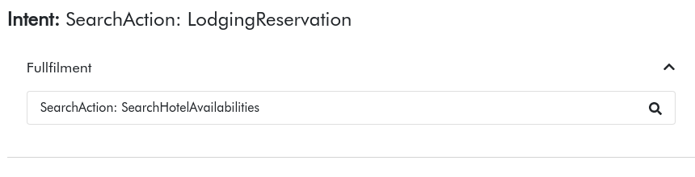

# Preface {docsify-ignore}

|        | Name, Affiliation |
|----------------|--------------------------------------------------------------|
| **Editor**:        | [Umutcan Şimşek](http://umutcan.eu), University of Innsbruck |
| **Contributors:**   | [Jürgen Umbrich](https://onlim.com), Onlim GmbH    |
| **Latest Version:** | {docsify-updated}                                                       |

# Introduction

The concept of "browsing the web" is being replaced by automated agents that access to structured content. Dialogue systems are a natural way to interact with the machine readable data and services on the web. With DIALSWS, we will develop an approach for annotating web APIs with a lightweight semantic vocabulary based on schema.org and an approach for semi-automatically generating open and flexible goal-oriented dialogue systems based on those Web APIs. 

Schema.org is one of the biggest collaborative vocabulary engineering projects and for the time being the de-facto standart. We aim to leverage the high-level adoption of the vocabulary by web content publishers an give them guidelines and tools to annotate not only their data but also their Web APIs. The semantic description of Web APIs, then will be used for semi-automated generation of intelligent agents, particularly dialogue systems.

The documentation below introduces the **Unified Intent Modeling Ontology** (UIMO) with some examples. For the details of Web API annotation with schema.org actions, see the [WASA Specification](http://wasa.cc).

# Unified Intent Modeling Ontology (UIMO)

There are many frameworks to help developers to create goal-oriented dialog systems. Such frameworks are built around the concept of intents, a piece of functionality that the dialog system supports, which is ultimately matched with the goal of the user. The fulfillment logic of those intents are typically strictly coupled with a specific framework and a backend service. This tight coupling creates a bottleneck in terms of interoperability and scalability. UIMO addresses this issue by providing a mechanism to describe an intent explicitly. Each intent is linked with its possible fulfillment methods that are represented with the WASA language.

> _TODO_ List reused ontologies and their purposes

?> You can find an overview of UIMO in the figure below. A human friendly documentation is coming soon. Until then please check out [the vocabulary in Turtle format](vocab/ext/UIMO.ttl ":ignore title"). 

UIMO Overview

## Example: Event Search Intent

<!--?> _TODO_ add a tabbed view for the graphical and Turtle representation of an intent -->

The core ontology already covers many aspects of dialog intents supported by various state-of-the art dialog system frameworks. Below we demonstrate how an intent modelled in UIMO can be mapped to a valid Alexa Intent:

Alexa Intent based on EventSearch intent modeled with UIMO

A mapper can deterministically map UIMO types and properties to [Amazon Alexa Interaction Model](https://developer.amazon.com/en-US/docs/alexa/smapi/interaction-model-schema.html). The language model defines the supported intents and their slots, as well as the sample annotated utterances. For example, `intents` object in the interaction model is generated based on the intent URI and slot definitions. The utterances in the `samples` array are generated based on the text position annotations of `:uttr1`. The dialog model defines the interaction of the skill and the user based on the defined intents. The `dialog.intents` object defines the required slots with the `elicitationRequired` property for each slot. Each `uimo:RequiredSlot` is mapped to a slot definition with a `true` value for this property. The values of prompts are created based on the uimo:question values of `uimo:RequiredSlot` instances.

## Example: Search Hotel Availabilities Intent

The intent generated based on a `SearchAction` with `LodgingReservation` result type is represent with UIMO as follows:

This intent is mapped to a DialogFlow intent:

Note that the intent generator contains a compabability layer that provides certain heuristics for framework specific mappings from UIMO.

# Intent Generation based on WASA Potential Actions

The screenshots below show the intent generator tool.

 ':class=custom.css')

<!--The doc folder contains a multipage HTML documentation created by Ontodocs.-->

<!--### See also:
* [Mapping and comparison of Schema.org, OpenAPI/SmartAPI and Hydra](Comparison.md)
* [Semantify.it Schema.org Actions Semantify.it Authentication Extension](Authentication.md)-->

# Publications
Şimşek, U., Kärle, E. & Fensel, D. (2018). Machine Readable Web APIs with Schema.org Action Annotations. Procedia Computer Science, 137, 255 - 261. doi: https://doi.org/10.1016/j.procs.2018.09.025 

Simsek,  U.,  Fensel,  D.:  Intent  generation  for goal-oriented  dialogue  systems based  on  schema.org annotations.  In:  The  Prooceedings  of  1st  International Workshop  on  Chatbots  co-located  with  ICWSM 2018  (2018),  http://dblp.uni-trier.de/db/journals/corr/corr1807.html#abs-1807-01292 (Preprint)

# Acknowledgement
**This work is partially supported by:**
 

 This work is licensed under a <a rel="license" href="http://creativecommons.org/licenses/by-sa/3.0/">Creative Commons Attribution-ShareAlike 3.0 Unported License</a>.
